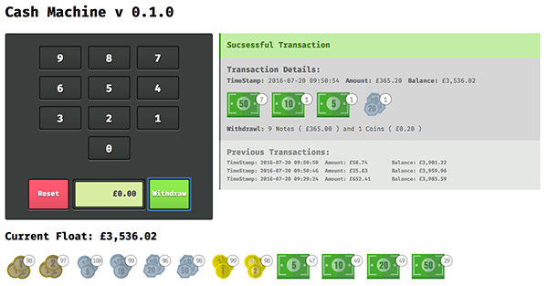

# Cash Point Application




## Installing
### Get the code
First up, clone this git repo to your local environment
```
git clone https://github.com/pete-hotchkiss/cash-machine
```

### Install project dependencies
Point your command line to the root folder you've cloned the git repos into and ensure all the npm dependencies are installed
```javascript
npm install
```
Install all the bower dependencies
```javascript
bower install
```

### Running the test
The app was built under TDD methodologies using Karma/Jasmine. TO view the tests at the command line enter
```
karma start tests/karma.conf.js --single-run
```


## Running the App
The app runs on a temporary local server via gulp. To start the app enter
```
gulp serve
```

This will run the default configuration of the app. If you want to switch out the algorithm to control how the cash machine prioritises how it returns the transaction then you should use an additional ```--withdrawal``` flag

By default the application assumes you'd like it to run in _'least'_ mode - that is the transaction uses the smallest possible number of coins/notes. However, to return the most possible £20 notes spin up the server using
```
gulp serve -w denomination
```

This argument will only accept two values at present either _least_ or _denomination_. The server start will fail if you try and pass an invalid argument

Additionally, if you want to override the value of the priority denomination ( which defaults to £20 ) then you can pass an additional ```--value``` argument along with your desired denomination value. *Note:* The value must be one of the denominations available and be passed in single units - i.e. £10 = 1000. The _cli_ will warn you if you try and pass an invalid value HandheldFriendly
```
gulp serve -w denomination --value 1000 // Will prioritise £10 notes in the resulting withdrawal
```

## Additional configuration considerations
The starting state of the _float_ is defined in a ```JSON``` file found in ```./app/data/float.json```. This contains details of all the possible denominations of currency including their type - i.e. _coin_ or _note_. The _"denomination"_ values should not be changed ( note all these are stored in single units so 1p = 1 and £1 = 100) but the amount value can be adjusted as desired  

## Other notes
The algorithm's used internally within this application are distinctly different but intrinsically linked within their execution.

1. When running in _least_ mode the application is solving what is effectively a _Knapsack Problem_ more commonly known as the *_Change Making Problem_*, and computationally similar to calculating ways a 9 dart finish could be completed in darts. Mathematically there are a number of approaches to tackle this, each of which vary in how intensive the process would be.

  In this instance out float is made up of denominations that fall into a canonical currency system, meaning we can use a greedy method to calculate our transaction. The algorithm continually picks the largest denomination available (_n_) reducing the target amount (_least_) accordingly; and continues to do so until such a point that either all available instances of that denomination have been depleted or _n > a_. In either instance it simply steps down to the next smallest denomination _n-1_ and repeats.

  However, should the denomination system within the currency have arbitrary values it could result in this _greedy_ approach returning no optimised results.

  > eg A system with coins/notes holding the values 1, 3, 4 attempting to withdraw 6 under the greedy method would return [ 4, 1, 1] for a total of 3 coins. However the optimal result would be [ 3, 3] or 2 coins

  In instances where the application needs to support arbitrary currency systems then the ability to switch out the algorithm for a more intensive bottom-up dynamic approach would be required.

2. The alternative _denomination_ mode, where in the application will heavily favour a given denomination (_m_) does run on the same _greedy_ system as detailed above, however rather than starting with the largest possible denomination (_n_) it begins the calculation loop with the denomination (_m_) using as many instances of this denomination that the float will allow.
